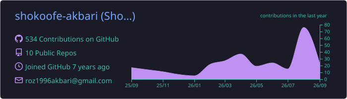
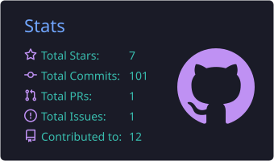
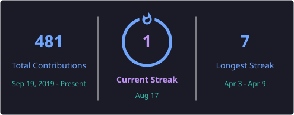
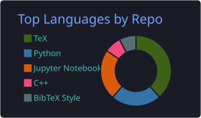
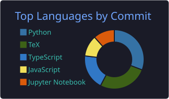

🧠 Computational Neuroscience • Synaptic Simulation • Digital Twins

  

<strong>I build mechanistic models that turn synaptic dynamics into testable computational experiments.</strong>

🔬 About Me

🎓 PhD Candidate in Mathematical Biology at Tarbiat Modares University

🧠 Specializing in computational neuroscience, with a focus on agent-based modeling of synaptic vesicles

⚡ Building advanced simulations of synaptic transmission, Ca²⁺-driven processes, and vesicle dynamics

🧬 Developing multiscale foundations for digital twins of neural and synaptic systems

🤖 Exploring how Large Language Models (LLMs) can accelerate scientific simulation, analysis, and discovery

🛠️ Core toolkit: C++/C, Python, R, MATLAB, NetLogo, Maple

🌱 Creating computational-biology content as BugCharm across Instagram, YouTube & Telegram

📫 Reach me at roz1996akbari@gmail.com

🚀 Featured Research & Projects

<table>
<tr>
<td width="33%" valign="top">

🧪 Python-Simulation-SV

<a href="https://github.com/shokoofe-akbari/Python-Simulation-SV"><strong>View Repository →</strong></a>

Simulation of Ca²⁺ influx, reaction-diffusion, and synaptic vesicle release inside a presynaptic terminal.

Synaptic Transmission Simulation Ca²⁺

</td>
<td width="33%" valign="top">

📊 3DSimDataProcessor

<a href="https://github.com/shokoofe-akbari/3DSimDataProcessor"><strong>View Repository →</strong></a>

Analysis and visualization tools for simulation outputs: step sizes, density maps, histograms, and trajectories.

3D Data Analysis Visualization

</td>
<td width="33%" valign="top">

📈 Movement-Size Analysis

<a href="https://github.com/shokoofe-akbari/movment_size_hist"><strong>View Repository →</strong></a>

Python-based analysis of vesicle movement-size distributions and simulation-derived movement behavior.

Python Statistics Vesicle Dynamics

</td>
</tr>
</table>

🌱 Currently Exploring

 

💻 Scientific Tech Stack

⚙️ Scientific Computing & Simulation

📊 Data Analysis & Scientific Visualization

🤖 Machine Learning & AI

🛠️ Research Development & Communication

📊 GitHub Analytics

  

<table align="center">
  <tr>
    <td width="50%" align="center" valign="middle">
      
    </td>
    <td width="50%" align="center" valign="middle">
      
    </td>
  </tr>
</table>
  

<table align="center">
  <tr>
    <td width="50%" align="center" valign="middle">
      
    </td>
    <td width="50%" align="center" valign="middle">
      
    </td>
  </tr>
</table>

  

  

Analytics are regenerated automatically by GitHub Actions.

🏆 GitHub Trophies

🐍 Contribution Snake

<picture>
  <source media="(prefers-color-scheme: dark)" srcset="https://raw.githubusercontent.com/shokoofe-akbari/shokoofe-akbari/output/github-contribution-grid-snake-dark.svg">
  <source media="(prefers-color-scheme: light)" srcset="https://raw.githubusercontent.com/shokoofe-akbari/shokoofe-akbari/output/github-contribution-grid-snake.svg">
  
</picture>

💡 Research Philosophy

“Turning biological complexity into computational experiments — and computational experiments into scientific insight.”

Biology × Mathematics × Simulation × AI

🌐 Connect With Me

