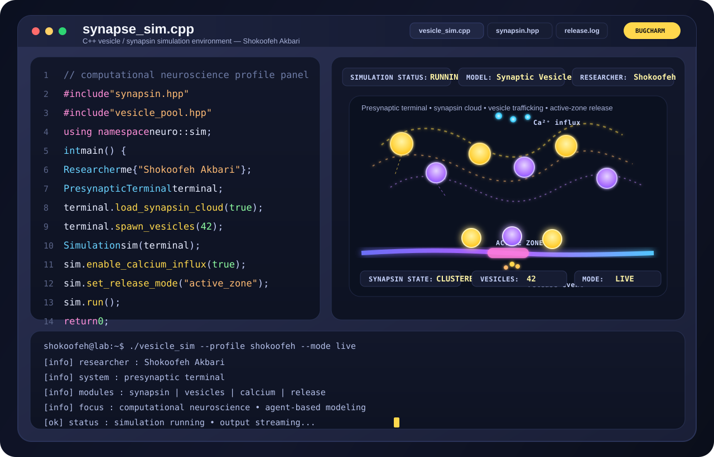
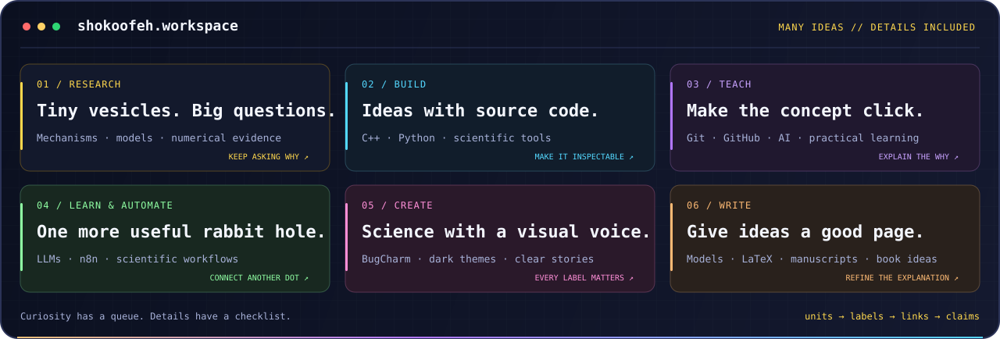
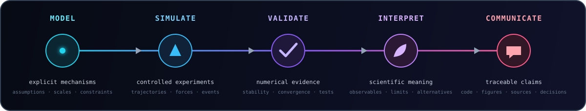

<!-- Shokoofeh's lab: refined synaptic-vesicle artwork + a lively, research-led profile. -->

# Hey, I'm Shokoofeh! 👋

### 🧠 Applied mathematician · 💻 Scientific programmer · 🚀 Educator & builder

**PhD Candidate in Applied Mathematics @ Tarbiat Modares University**

*A busy mind, a love for mechanisms, and a very specific question about that axis label.*

[My world](#my-world) · [Research](#research-mode) · [Projects](#things-i-build) · [My process](#how-i-work) · [Connect](#say-hello)

[🧑‍💼 LinkedIn](https://www.linkedin.com/in/shokoofeh-akbari) · [📫 Email](mailto:roz1996akbari@gmail.com) · [🐞 BugCharm](https://bugcharm.com/) · [🌙 Instagram](https://www.instagram.com/shokoofeh.akbari_com)

 

<picture>
  <source media="(max-width: 600px)" srcset="./assets/synapse-sim-mobile.svg" />
  
</picture>

An animated illustration of my research world — code, motion, and geometry are conceptual, not simulation results. 
[🔎 Open the lab in full size](./assets/synapse-sim.svg)

 

**I turn biological mechanisms into computational experiments — then ask one more question.**

## My world

Hi! I'm **Shokoofeh Akbari**, a **PhD Candidate in Applied Mathematics** working where mathematical biology, computational neuroscience, and scientific programming meet.

My main research obsession is the **synaptic vesicle cycle**: how tiny biological agents move, interact, organize, and give rise to behavior we can study through models. I work with **agent-based modeling, stochastic simulation, and scientific computing**, mainly in **C++ and Python**.

Around that core, there is usually a workshop to design, an AI idea to test, a workflow to automate, a piece of content to create, or a mathematical explanation to refine. I enjoy connecting the pieces. 🧩

> **Curiosity keeps the tabs open. Attention to detail makes the work useful.**

<picture>
  <source media="(max-width: 600px)" srcset="./assets/brain-workbench-mobile.svg" />
  
</picture>

## Research mode

### 🔬 Small vesicles. Big mathematical questions.

My doctoral research focuses on mechanistic models of **synaptic-vesicle motion and organization**, including **synapsin-mediated interactions**. **SimulationSV** is my doctoral research codebase, currently under research development.

The questions I keep coming back to:

- **🧠 Mechanisms:** how do stochastic motion, interactions, and spatial constraints shape vesicle behavior?
- **⚙️ Numerics:** how do timestep choices and constraint handling affect the quantities we measure?
- **📊 Evidence:** which patterns survive numerical checks, and what scientific conclusions do they support?

My research connects **mathematical assumptions → simulation behavior → observable quantities → careful interpretation**. The public projects below show parts of the surrounding engineering and analysis work.

**Research keywords:** `Agent-Based Models` · `Brownian Dynamics` · `Computational Neuroscience` · `Mechanistic Modeling` · `Numerical Validation`

<picture>
  <source media="(max-width: 600px)" srcset="./assets/vesicle-cycle-mobile.svg" />
  
</picture>

A simplified biological context: my current research focus is motion and organization. The full cycle shown here does not imply that every process is implemented in SimulationSV. Recycling pathways and timing are schematic.

## Things I build

### 📐 TMU Thesis Template — making the document behave

[**TMU-Thesis-Template**](https://github.com/shokoofe-akbari/TMU-Thesis-Template) is a maintained LaTeX system for MSc and PhD theses: Persian typesetting, mathematical environments, bibliography options, build scripts, CI, and versioned releases.

**My part:** technical maintenance and extension, while preserving the original authors' credit and third-party notices.

**The details I care about:** theorem environments, bibliography behavior, build reliability, and instructions that students can actually follow.

`LaTeX` · `XeLaTeX` · `GitHub Actions` · `Documentation`

[📂 Source](https://github.com/shokoofe-akbari/TMU-Thesis-Template) · [📦 Releases](https://github.com/shokoofe-akbari/TMU-Thesis-Template/releases) · [✅ Build history](https://github.com/shokoofe-akbari/TMU-Thesis-Template/actions/workflows/latex.yml)

### 🧪 Git State Lab — let the mental model click

[**Git State Lab**](https://github.com/shokoofe-akbari/git-portal-lab-github) turns Git into an interactive learning experience: file states, graph scenarios, merge/rebase concepts, quizzes, and command sequences.

Built around the questions that come up in my **Git & GitHub workshop**. Because watching a file move from working directory to staging to commit makes the explanation come alive. 💡

`TypeScript` · `React` · `Vite` · `Interactive Education`

[🚀 Try the lab](https://git-portal-lab-github.vercel.app/) · [📂 Source](https://github.com/shokoofe-akbari/git-portal-lab-github) · [📚 Workshop resources](https://github.com/shokoofe-akbari/GitAndGitHubWorkshop)

### 📊 3D Simulation Data Processor — coordinates with a story

[**3DSimDataProcessor**](https://github.com/shokoofe-akbari/3DSimDataProcessor) contains Python scripts for particle trajectories, step-size distributions, density maps, correlations, and scientific plots. An early public tool from my simulation-analysis work.

This is where the question changes from **“where did the particles go?”** to **“what does that movement tell us?”**

`Python` · `NumPy` · `SciPy` · `Matplotlib` · `Seaborn`

[📂 Explore the code](https://github.com/shokoofe-akbari/3DSimDataProcessor)

### 🎒 Also on the workbench

- [**Git & GitHub Workshop**](https://github.com/shokoofe-akbari/GitAndGitHubWorkshop) — a cheat sheet, Persian contribution and licensing guides, README guidance, and a reusable GitHub Actions prompt. Teaching real collaboration, one practical question at a time.
- [**Wealth Scenario Simulator**](https://github.com/shokoofe-akbari/wealth-app) — an educational React interface for compound growth, scenario assumptions, and uncertainty. A side quest in making mathematical models explorable.
- [**Mathematical modeling notes**](https://github.com/shokoofe-akbari/MyArticles) — LaTeX sources on reaction–diffusion modeling and cellular dynamics. Ideas deserve clear equations and readable pages. ✍️

## How I work

<picture>
  <source media="(max-width: 600px)" srcset="./assets/research-pipeline-mobile.svg" />
  
</picture>

**Stochastic simulations. Deliberate decisions.**

I make assumptions explicit, design computational experiments, and connect conclusions to inspectable evidence. Numerical stability, observable convergence, and biological interpretation each need their own checks. AI helps me explore and document ideas while the reasoning stays accountable.

### 🔎 Little things that get my attention

- units that stay consistent from the equations to the plots;
- an axis label that says exactly what was measured;
- configurations, seeds, and sources that make a result traceable;
- a README whose quick start includes all the steps;
- clear diagrams, consistent typography, and links that work;
- a claim whose wording matches the evidence behind it.

Yes, I am the person who will notice that one label. 😄

## The toolbox

**💻 My daily anchors** 
`C++` · `Python` · `Git` · `LaTeX`

**📊 Scientific sidekicks** 
`NumPy` · `SciPy` · `pandas` · `Matplotlib` · `Seaborn` · `Plotly` · `Jupyter`

**🛠️ Things that keep the work moving** 
`GitHub Actions` · `Markdown` · `React` · `TypeScript`

**🤖 My AI & automation playground** 
`LLM workflows` · `Hugging Face` · `n8n` · `Prompt Design`

<strong>📚 Open my learning shelf</strong>

I am deepening my LLM knowledge through coursework and practical exercises, exploring how AI can support scientific work, and connecting simulation research with the foundations of multiscale models and digital twins.

[**Hands-On Large Language Models**](https://github.com/shokoofe-akbari/Hands-On-Large-Language-Models) and [**NotebookLM Prompt Styles**](https://github.com/shokoofe-akbari/notebooklm-prompt-styles) are part of my learning/reference shelf. These repositories are forks of other authors' work; credit belongs to their original creators.

## Beyond the terminal

### 🐞 BugCharm · 🌙 Science content · 🎓 Academic community

I am the **co-founder of BugCharm**, where I develop educational content and work on workflow automation. I teach **Git, GitHub, and artificial intelligence**, and enjoy building learning experiences that make complicated ideas click.

I also serve as **Secretary of the Applied Mathematics Student Scientific Association at Tarbiat Modares University**, helping prepare scientific, educational, and cultural content for the university community.

On [**Instagram**](https://www.instagram.com/shokoofeh.akbari_com), I create dark-themed educational content about **mathematical modeling, simulation, AI, and digital twins**. The same attention I bring to a numerical experiment also finds its way into a diagram, a slide, and an explanation. 🎨

<strong>🗺️ The longer-term quests</strong>

- Advance my doctoral research and develop it into defensible research papers.
- Write about mathematical modeling and translate Simon Serovajsky's *Mathematical Modeling*.
- Keep improving my teaching and building practical courses.
- Grow into specialized work in scientific software, simulation engineering, and AI for Science.

## Say hello

Have a biological mechanism to model, a scientific tool to build, a research question to investigate, or a technical idea to teach? **Let's connect the dots.** 🧩

I welcome **research collaborations and specialized opportunities** in computational modeling, simulation engineering, scientific software, **AI for Science**, and digital-twin research.

[**📫 Email**](mailto:roz1996akbari@gmail.com) · [**🧑‍💼 LinkedIn**](https://www.linkedin.com/in/shokoofeh-akbari) · [**🐞 BugCharm**](https://bugcharm.com/) · [**🌙 Instagram**](https://www.instagram.com/shokoofeh.akbari_com)

 

**Biology × Mathematics × Simulation × AI**

A busy workbench. A curious mind. Details included. ✨

